# Лабораторная работа №2. Введение в WordPress

## Цель работы

Научиться устанавливать WordPress в локальной среде, осваивать админ-панель, изменять внешний вид сайта через темы и расширять его функциональность с помощью плагинов.
## Ход выполнения работы

### Шаг 1. Подготовка среды

Для выполнения лабораторной работы была использована локальная среда разработки **XAMPP**. Были запущены модули **Apache** и **MySQL**, после чего была проверена доступность локального сервера по адресу `http://localhost`.

Далее через **phpMyAdmin** была создана отдельная база данных для сайта WordPress. Использование отдельной базы данных позволило изолировать сайт лабораторной работы от других локальных проектов.

**Рисунок 1 – Запущенные модули Apache и MySQL в XAMPP**  
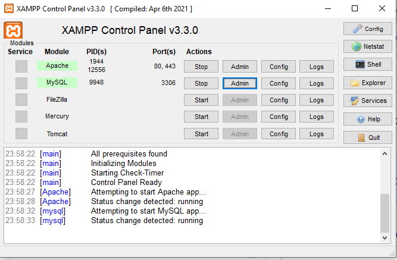

**Рисунок 2 – Созданная база данных в phpMyAdmin**  
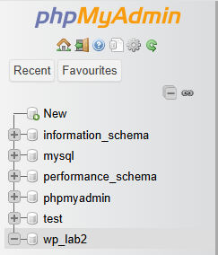

### Шаг 2. Установка WordPress

Дистрибутив WordPress был подготовлен для локального использования и размещён в папке `htdocs`. После этого сайт был открыт в браузере по локальному адресу. В процессе установки были указаны параметры подключения к базе данных: имя базы данных, имя пользователя MySQL, хост и префикс таблиц.

После завершения установки была создана административная учётная запись, что позволило войти в административную панель и приступить к дальнейшей настройке сайта.

**Рисунок 3 – Локальный сайт WordPress после установки**  
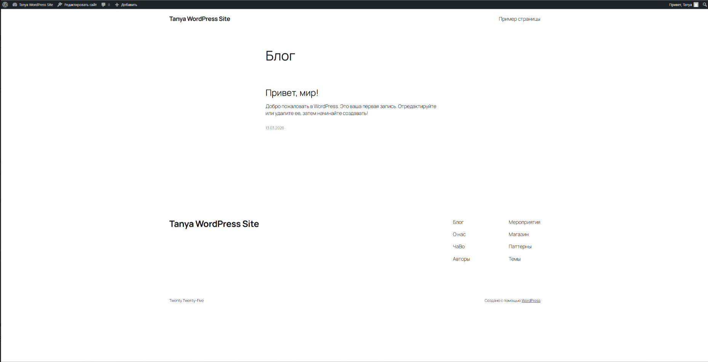

**Рисунок 4 – Административная панель WordPress**  
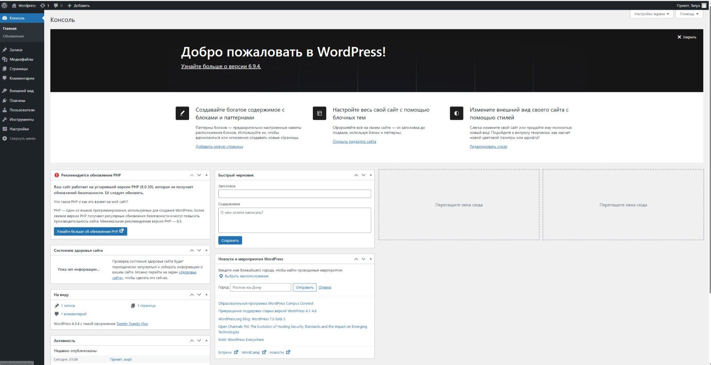

### Шаг 3. Первоначальные настройки сайта

После установки WordPress были выполнены первоначальные настройки сайта. В разделе **Settings → General** было изменено название сайта, добавлено краткое описание и установлен корректный часовой пояс.

В рамках лабораторной работы были заданы следующие параметры сайта:

- **Название сайта:** `Tanya WordPress Site`
- **Краткое описание:** `Website created for WordPress laboratory work`

Затем в разделе **Settings → Permalinks** был установлен вариант **Post name**, чтобы ссылки на страницы и записи имели более удобный и читаемый вид.

**Рисунок 5 – Настройки сайта в разделе General**  
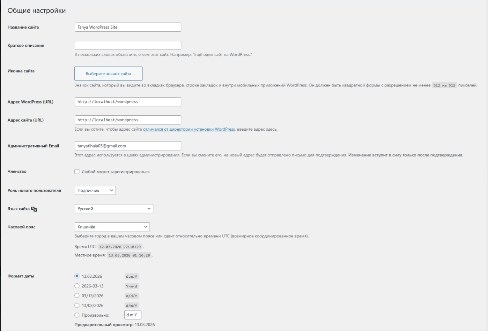

**Рисунок 6 – Настройка постоянных ссылок в разделе Permalinks**  
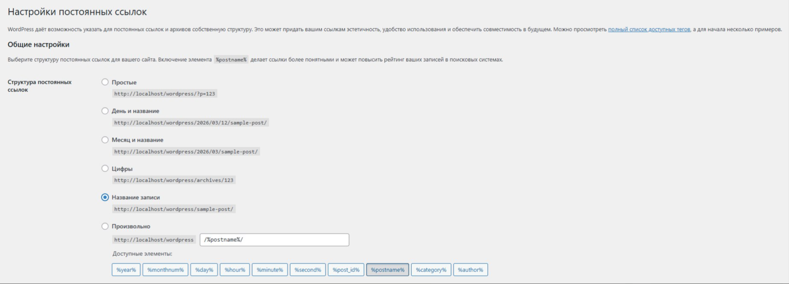

### Шаг 4. Работа с темами

На следующем этапе была выполнена работа с темами оформления. В разделе **Appearance → Themes** была установлена и активирована новая тема **Astra** из официального каталога WordPress.

После активации новой темы был проведён визуальный анализ изменений внешнего вида сайта. Было отмечено, что изменились структура главной страницы, оформление меню, цветовая схема и стили отдельных блоков.

Затем через раздел **Appearance → Customize** были выполнены дополнительные настройки темы. Были изменены заголовок сайта, краткое описание, цветовая схема и другие параметры внешнего вида. Также при необходимости может быть добавлен логотип сайта через стандартные средства настройки темы.

**Рисунок 7 – Раздел Themes с установленной и активной темой Astra**  

**Рисунок 8 – Раздел Customize для настройки темы**  
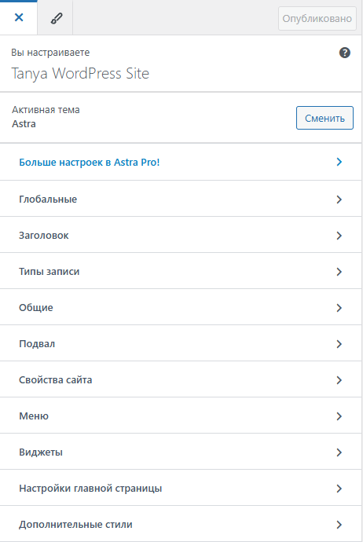

**Рисунок 9 – Главная страница сайта после изменения темы**  
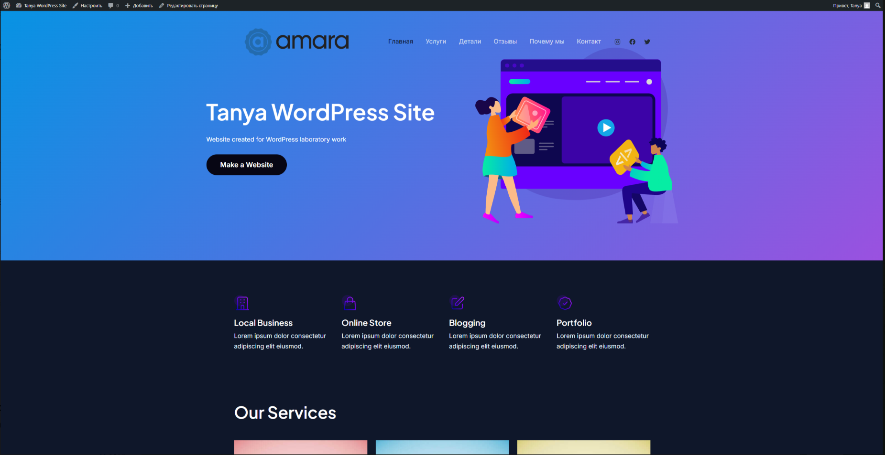

### Шаг 5. Работа с плагинами

Далее была выполнена установка и активация плагинов через раздел **Plugins → Add New**. В соответствии с заданием были добавлены следующие плагины:

- **Classic Editor** - для использования классического редактора записей;
- **Contact Form 7** - для создания формы обратной связи.

После активации плагина **Classic Editor** была проверена возможность создания новой записи. Вместо стандартного блочного редактора WordPress стал доступен классический редактор, что подтвердило корректную работу плагина.

После активации **Contact Form 7** была создана стандартная форма обратной связи, которую затем можно было использовать на отдельной странице сайта.

Также в разделе **Installed Plugins** один из плагинов был временно деактивирован. После этого было проверено, что его функциональность перестала быть доступной. Затем плагин был активирован повторно.

**Рисунок 10 – Установка плагинов в разделе Add New Plugin**  
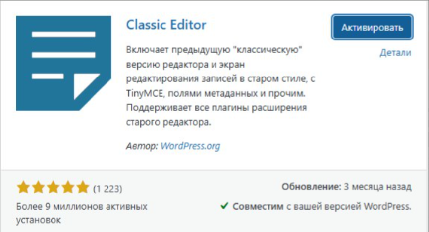
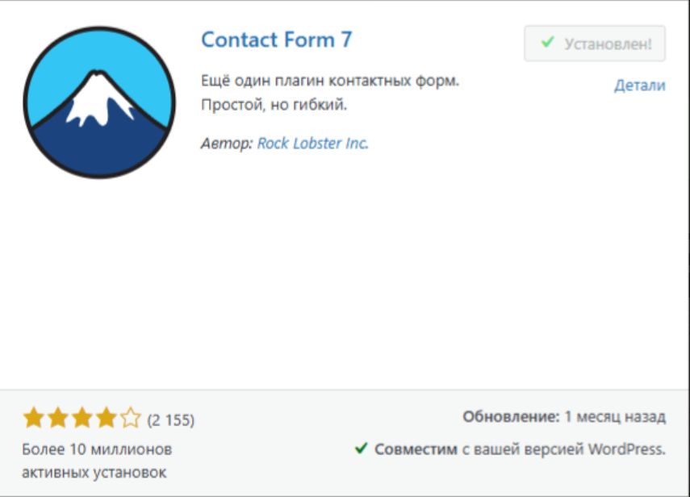

**Рисунок 11 – Установленные и активированные плагины Classic Editor и Contact Form 7**  
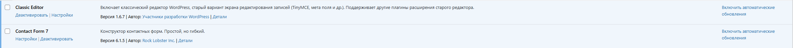

**Рисунок 12 – Деактивация одного из плагинов**  
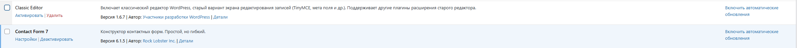Н

### Шаг 6. Создание контента

На заключительном этапе был создан контент сайта. Сначала была создана страница **«Контакты»**, на которую была добавлена форма обратной связи, созданная при помощи плагина **Contact Form 7**.

После этого были созданы несколько записей в блоге с различным содержимым. В частности, была создана текстовая публикация, а также запись с изображением. Затем была выполнена проверка отображения созданного контента на сайте.

Это позволило убедиться, что WordPress предоставляет удобные инструменты для добавления и публикации материалов без необходимости редактирования кода.

**Рисунок 13 – Создание страницы «Контакты» в WordPress**  
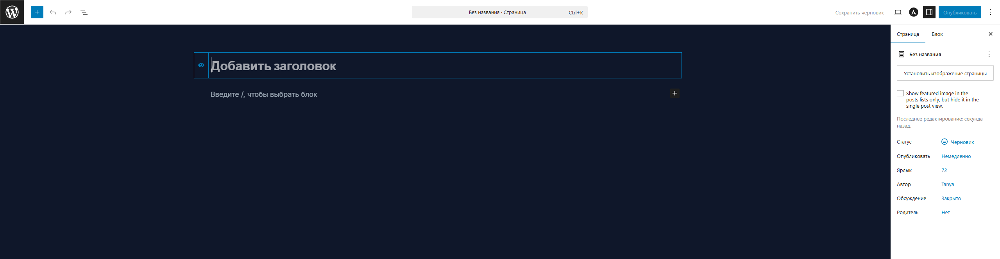

**Рисунок 14 – Страница «Контакты» с формой обратной связи на сайте**  
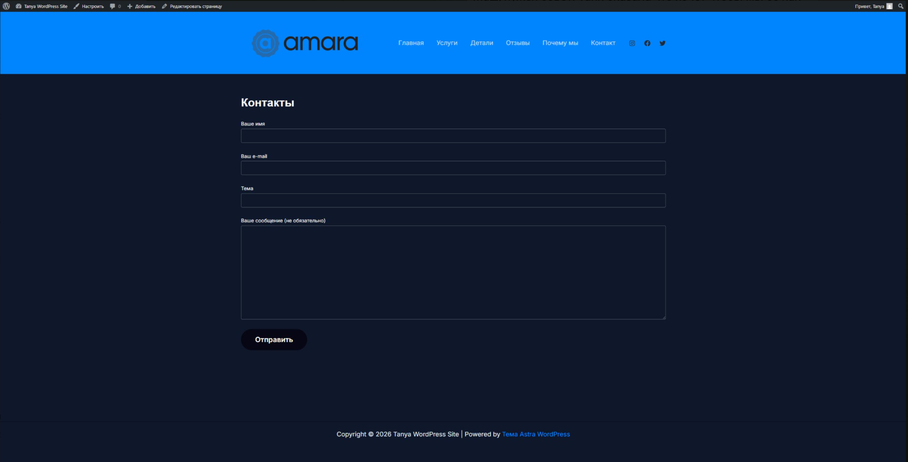

**Рисунок 15 – Созданные записи в разделе Posts**  
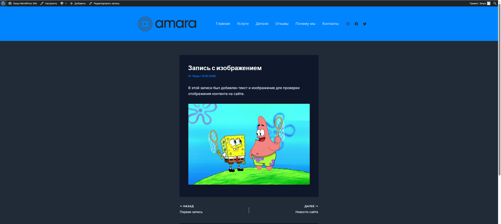

**Рисунок 16 – Отображение записей на сайте**  

## Результат работы

В ходе выполнения лабораторной работы был успешно установлен и настроен WordPress в локальной среде. Были изучены базовые возможности административной панели, выполнены первоначальные настройки сайта, установлена и активирована новая тема, добавлены и протестированы плагины, а также создан контент сайта.

В результате был получен работоспособный локальный WordPress-сайт с изменённым внешним видом, расширенной функциональностью и заполненными страницами.

## Ответы на контрольные вопросы

### 1. Что делает тема в WordPress, а что - плагин?

**Тема** отвечает за внешний вид сайта. Она определяет оформление страниц, цветовую схему, структуру блоков, меню, шрифты и общий дизайн.

**Плагин** отвечает за дополнительную функциональность. С его помощью можно добавить форму обратной связи, редактор, галерею, защиту, SEO-возможности и другие функции.

Таким образом, тема определяет, **как сайт выглядит**, а плагин - **какие возможности он получает**.

### 2. Почему при смене темы контент сайта не теряется?

Контент сайта не теряется при смене темы, потому что страницы, записи, пользователи и другие данные хранятся в **базе данных WordPress**, а не внутри файлов темы.

Тема лишь изменяет способ отображения контента, но не удаляет сами данные.

### 3. Как можно изменить внешний вид сайта без редактирования кода?

Внешний вид сайта можно изменить без редактирования кода несколькими способами:

- через раздел **Appearance → Themes**, установив и активировав другую тему;
- через раздел **Appearance → Customize**, где можно изменить название сайта, описание, цвета, логотип, меню и другие параметры;
- при помощи некоторых визуальных плагинов и средств настройки темы.

Таким образом, WordPress позволяет выполнять многие изменения интерфейса через административную панель.

## Вывод

В результате выполнения лабораторной работы были получены практические навыки установки WordPress в локальной среде и подключения его к базе данных. Также была изучена структура административной панели и выполнены основные настройки сайта.

В ходе работы были освоены установка и активация темы, изменение внешнего вида сайта, подключение и проверка плагинов, а также создание страниц и записей. Практическая часть показала, что WordPress является удобной системой управления контентом, позволяющей создавать и администрировать сайты без глубокого знания программирования.

