# Лабораторная работа №3. Разработка простой темы WordPress

## Цель работы

Научиться создавать собственную тему WordPress, разобраться в её минимальной структуре и принципах работы шаблонов.

### Шаг 1. Подготовка среды

Для выполнения лабораторной работы использовалась локальная установка WordPress, развёрнутая в среде XAMPP. В каталоге WordPress был открыт путь `wp-content/themes`, где хранятся все темы оформления сайта.

Внутри папки `themes` была создана новая директория пользовательской темы с именем `usm-theme`. После этого в корневом файле конфигурации WordPress `wp-config.php` была включена отладка путём установки параметра `WP_DEBUG` в значение `true`. Это позволяет выводить возможные ошибки и упрощает процесс разработки темы.

**Рисунок 1 - Файл wp-config.php с включённым параметром WP_DEBUG**  
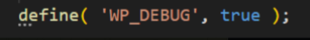

### Шаг 2. Создание обязательных файлов темы

В созданной папке `usm-theme` были подготовлены основные обязательные файлы темы: `style.css` и `index.php`.

В файле `style.css` были размещены метаданные темы, необходимые для распознавания темы системой WordPress. Также в этом файле были добавлены базовые CSS-стили для оформления основных элементов страницы.

Файл `index.php` был создан как главный шаблон темы. В него была добавлена базовая структура вывода контента и цикл WordPress для отображения последних записей на главной странице сайта.

**Рисунок 2 - Содержимое файла index.php**  
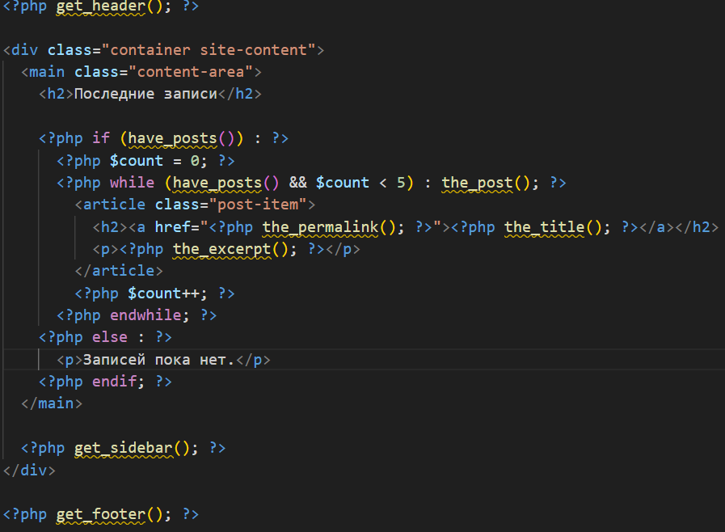

### Шаг 3. Общие части шаблонов

На следующем этапе были созданы общие части шаблонов: `header.php` и `footer.php`. В файл `header.php` был вынесен код шапки сайта, включающий HTML-структуру документа, подключение `wp_head()` и вывод названия и описания сайта.

В файл `footer.php` был вынесен код подвала сайта с подключением функции `wp_footer()`. Это позволяет WordPress корректно подключать скрипты и завершать HTML-структуру страницы.

В основном файле `index.php` были подключены шаблоны шапки и подвала при помощи функций `get_header()` и `get_footer()`. Также в теме был создан файл `sidebar.php`, который отвечает за отображение боковой панели. Он был подключён в шаблонах с помощью функции `get_sidebar()`.

На главной странице сайта был реализован вывод последних записей с использованием цикла WordPress.

**Рисунок 3 - Содержимое файла header.php**  
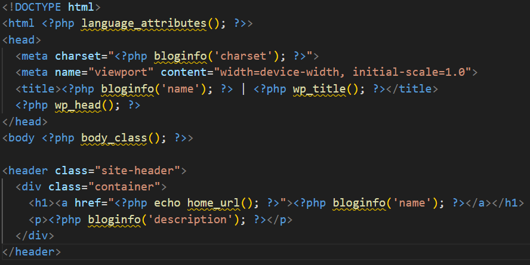

**Рисунок 4 - Содержимое файла footer.php**  
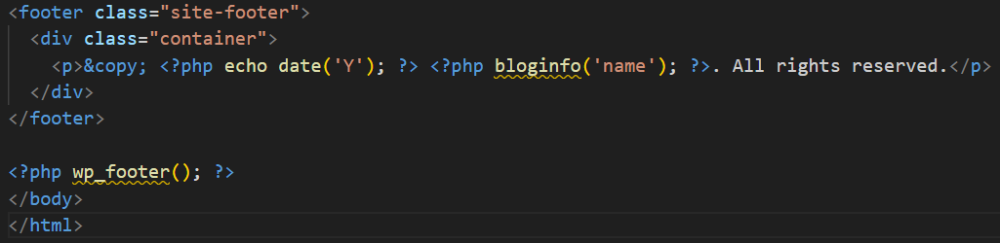

**Рисунок 5 - Содержимое файла sidebar.php**  
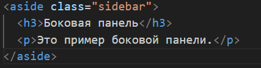

### Шаг 4. Файл функций

Для подключения стилей темы был создан файл `functions.php`. В этом файле была реализована функция `usm_theme_enqueue_styles()`, которая подключает файл стилей темы с помощью функции `wp_enqueue_style()`.

Использование `functions.php` является стандартным подходом WordPress для подключения CSS- и JavaScript-файлов темы, а также для добавления другой пользовательской логики.

**Рисунок 6 - Содержимое файла functions.php**  
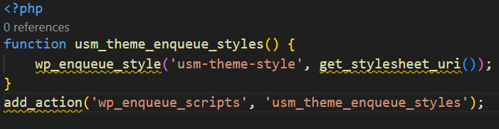

### Шаг 5. Дополнительные шаблоны

Для более полной структуры темы были созданы дополнительные шаблоны:

- `single.php` - для отображения отдельной записи;
- `page.php` - для отображения отдельных страниц;
- `comments.php` - для вывода комментариев и формы комментирования;
- `archive.php` - для вывода архивов записей;
- `sidebar.php` - для боковой панели.

Файлы `single.php` и `page.php` были настроены таким образом, чтобы подключать шапку, подвал, боковую панель и секцию комментариев. Это позволило обеспечить единый стиль и структуру отображения разных типов страниц сайта.

**Рисунок 7 - Содержимое файла single.php**  
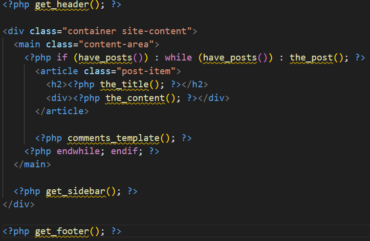

**Рисунок 8 - Содержимое файла page.php**  
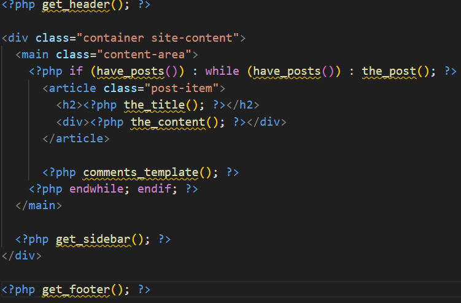

**Рисунок 9 - Содержимое файла comments.php**  
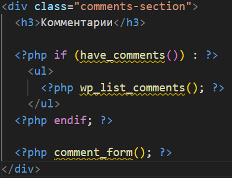

**Рисунок 10 - Содержимое файла archive.php**  
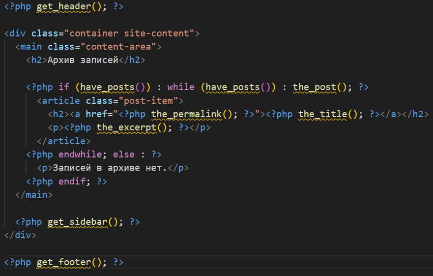

### Шаг 6. Стилизация темы

После подготовки шаблонов были добавлены стили для основных элементов темы. В файле `style.css` были оформлены:

- шапка сайта;
- подвал сайта;
- основной контент;
- боковая панель;
- ссылки и заголовки;
- блоки записей.

Стилизация была выполнена таким образом, чтобы тема имела аккуратный и читаемый внешний вид. Были использованы отступы, фоновые цвета, тени, закругления блоков и стандартные параметры оформления текста.

### Шаг 7. Скриншот темы

Для корректного отображения темы в панели WordPress в папку `usm-theme` был добавлен файл `screenshot.png`, представляющий собой превью темы. Этот файл используется WordPress в разделе **Appearance → Themes** для отображения изображения темы перед её активацией.

**Рисунок 11 - Файл screenshot.png в папке темы**  
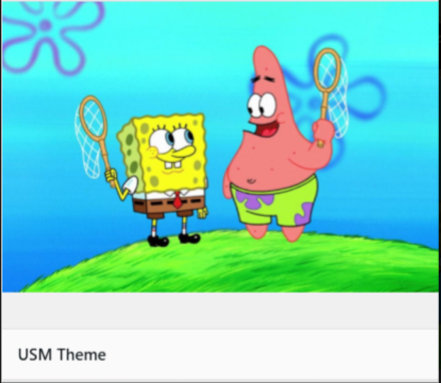

### Шаг 8. Активация темы

После создания всех необходимых файлов была выполнена активация пользовательской темы через административную панель WordPress в разделе **Appearance → Themes**.

После активации тема стала доступна на сайте. Была выполнена проверка отображения главной страницы, списка последних записей, боковой панели, шапки и подвала сайта. Также была проверена корректная работа шаблонов `single.php` и `page.php`.

В результате сайт начал отображаться с использованием собственной темы `USM Theme`, разработанной в рамках лабораторной работы.

**Рисунок 12 - Главная страница сайта после активации темы**  
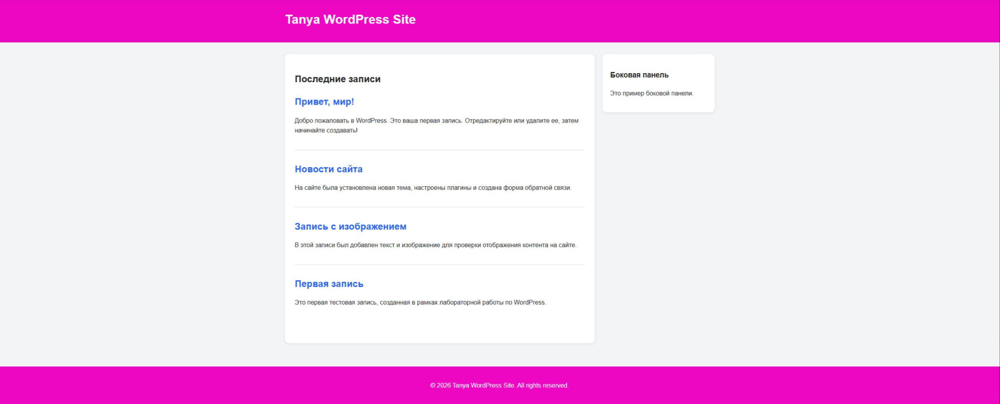

**Рисунок 13 - Отдельная запись, открытая через шаблон single.php**  
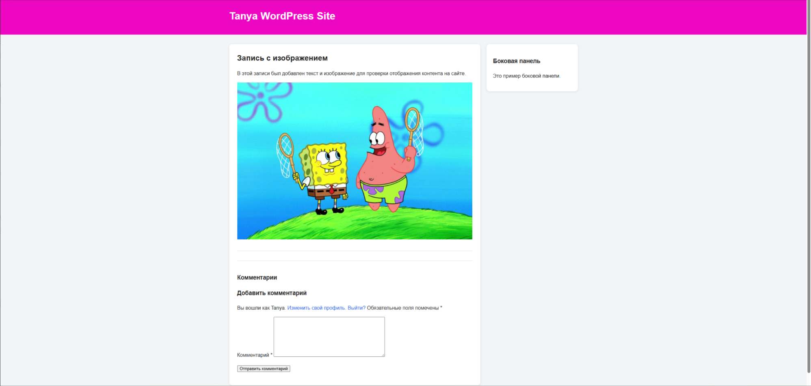

**Рисунок 14 - Обычная страница, открытая через шаблон page.php**  
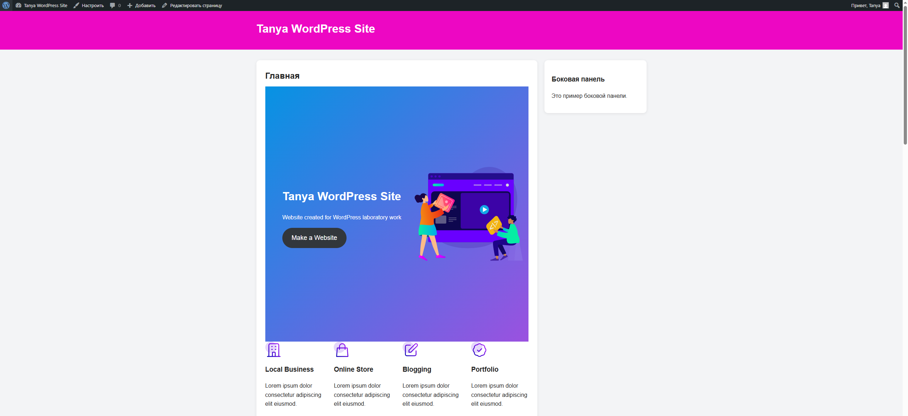

## Результат работы

В ходе выполнения лабораторной работы была успешно разработана простая пользовательская тема WordPress. Были изучены принципы организации темы, структура шаблонов и способы подключения общих частей интерфейса.

В результате была получена работоспособная тема с собственными шаблонами, стилями, боковой панелью, подвалом и шапкой, а также с отображением записей и страниц сайта.

## Вывод

В процессе выполнения лабораторной работы были получены практические навыки разработки собственной темы WordPress. Была изучена минимальная структура темы, назначение основных шаблонов и механизм их подключения через стандартные функции WordPress.

Также был освоен принцип разделения интерфейса на отдельные части: шапку, подвал, боковую панель, шаблон главной страницы, шаблон записи и шаблон страницы. Лабораторная работа показала, что даже простая тема WordPress строится по определённой архитектуре и может быть расширена в дальнейшем.
