# Лабораторная работа №4. Разработка плагина для WordPress

## Цель работы

Освоить расширяемую модель данных WordPress: создать CPT (Custom Post Type), пользовательскую таксономию, метаданные с метабоксом в админ-панели, а также реализовать виджет для отображения данных на сайте.

### Шаг 1. Подготовка среды

Для выполнения лабораторной работы использовалась локальная установка WordPress, развёрнутая в среде XAMPP. В каталоге WordPress был открыт путь `wp-content/plugins`, где размещаются все пользовательские плагины системы.

Внутри папки `plugins` была создана новая директория плагина с именем `usm-notes`. После этого в корневом файле конфигурации WordPress `wp-config.php` была включена отладка путём установки параметра `WP_DEBUG` в значение `true`. Это позволяет отображать возможные ошибки и облегчает разработку и тестирование плагина.

**Рисунок 1 - Папка usm-notes в каталоге wp-content/plugins**  

### Шаг 2. Создание основного файла плагина

В созданной папке `usm-notes` был подготовлен основной файл плагина `usm-notes.php`. В этом файле были размещены метаданные плагина, необходимые для распознавания его системой WordPress: название, описание, версия и автор.

Также в файл была добавлена базовая защита от прямого обращения через проверку константы `ABSPATH`. После этого плагин был активирован через административную панель WordPress в разделе **Plugins**. Активация прошла без ошибок, что подтвердило корректность начальной структуры плагина.

**Рисунок 2 - Содержимое файла usm-notes.php с метаданными плагина**  
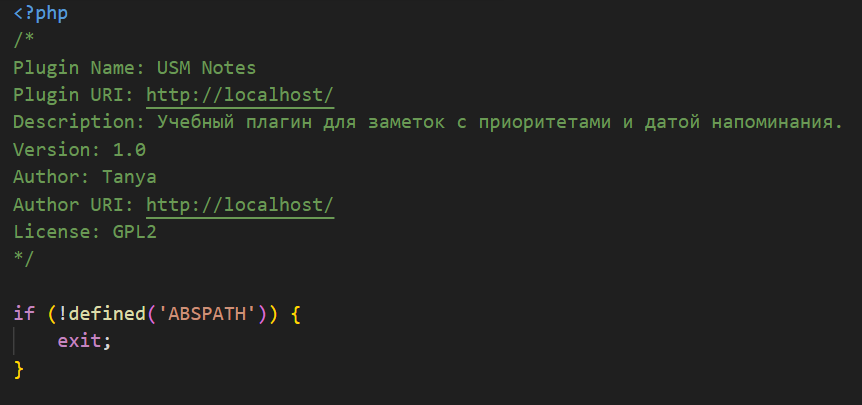

**Рисунок 3 - Активированный плагин USM Notes в панели WordPress**  
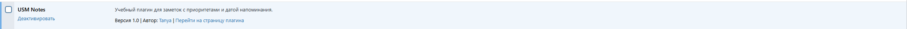

### Шаг 3. Регистрация Custom Post Type

На следующем этапе в плагине была реализована регистрация пользовательского типа записей **Notes** с помощью функции `register_post_type()`. Для нового типа записей были настроены текстовые метки интерфейса, публичность, архивная страница, иконка в административном меню, а также поддержка заголовка, редактора, автора и миниатюры.

Регистрация пользовательского типа записей была подключена через хук `init`, что обеспечивает создание нового типа данных при инициализации WordPress. После этого в административной панели появился отдельный раздел **«Заметки»**.

**Рисунок 4 - Раздел «Заметки» в административной панели WordPress**  
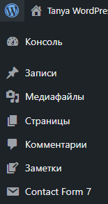

### Шаг 4. Регистрация пользовательской таксономии

После создания пользовательского типа записей была добавлена пользовательская таксономия **Priority** с помощью функции `register_taxonomy()`. Эта таксономия была связана с типом записей `usm_note` и использовалась для классификации заметок по приоритету.

Таксономия была настроена как иерархическая, аналогично стандартным категориям WordPress. Также были определены текстовые метки, публичность и отображение в административной таблице. После регистрации таксономии в разделе заметок появился подпункт **«Приоритет»**, где были созданы значения **High**, **Medium** и **Low**.

**Рисунок 5 - Таксономия «Приоритет» в разделе заметок**  
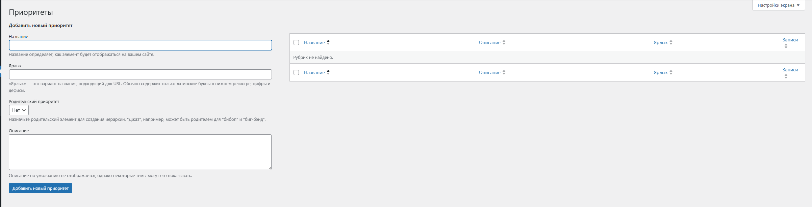

**Рисунок 6 - Созданные значения High, Medium и Low**  
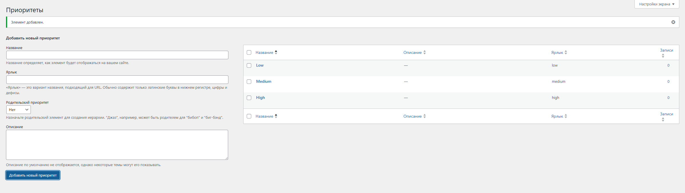

### Шаг 5. Добавление метабокса для даты напоминания

Для хранения даты напоминания был создан метабокс **Due Date**, который отображается в редакторе заметки. Метабокс был добавлен с помощью функции `add_meta_box()`. Внутри него было размещено поле выбора даты на основе HTML5-элемента `input type="date"`.

Для сохранения введённого значения была реализована функция, подключённая к хуку `save_post`. Значение даты сохраняется в метаполе `_usm_due_date`. Для безопасности была добавлена проверка `nonce`, которая подтверждает, что данные были отправлены именно из формы WordPress.

Также было сделано обязательное заполнение поля даты. Кроме того, была добавлена проверка, которая запрещает сохранять дату, если она находится в прошлом. В случае ошибки пользователю выводится сообщение, а корректное сохранение записи не выполняется. Дополнительно дата напоминания была выведена в отдельной колонке в списке записей типа **Заметки** в административной панели.

**Рисунок 7 - Метабокс Due Date в редакторе заметки**  
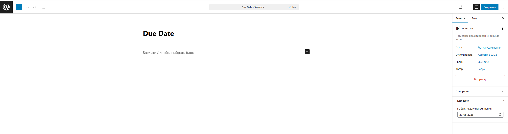

**Рисунок 8 - Сообщение об ошибке при попытке сохранить пустую дату или дату из прошлого**  
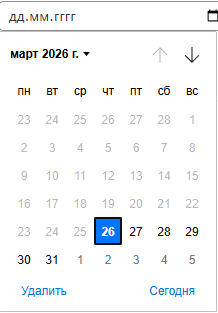

**Рисунок 9 - Колонка Due Date в списке заметок**  
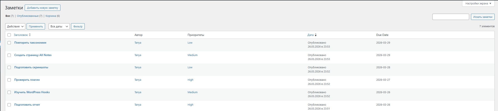

### Шаг 6. Создание шорткода для отображения заметок

На данном этапе был создан шорткод `[usm_notes]` для вывода заметок на странице сайта. В функции шорткода была реализована обработка двух параметров: `priority` и `before_date`.

Параметр `priority` позволяет выводить заметки с определённым уровнем приоритета, а параметр `before_date` — заметки, дата напоминания которых меньше или равна указанной. Если параметры не заданы, шорткод отображает все заметки.

Для получения данных использовался запрос к заметкам с учётом переданных фильтров. После этого список заметок выводился на страницу. Для оформления отображения были добавлены стили. Также был предусмотрен случай, когда подходящих заметок нет: в этом случае выводится сообщение **«Нет заметок с заданными параметрами»**.

**Рисунок 10 - Добавление страницы All Notes и Добавление шорткода [usm_notes] на страницу**  
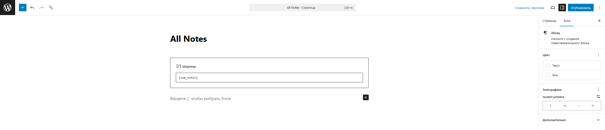

### Шаг 7. Тестирование плагина

После реализации шорткода было выполнено тестирование плагина. Для этого были созданы 5–6 заметок с разными значениями приоритета (**High**, **Medium**, **Low**) и разными датами напоминания.

Далее была создана страница **All Notes**, на которой поочерёдно проверялись разные варианты работы шорткода:

- `[usm_notes]` — вывод всех заметок;
- `[usm_notes priority="high"]` — вывод заметок с высоким приоритетом;
- `[usm_notes before_date="2025-04-30"]` — вывод заметок с датой напоминания до 30 апреля 2025 года.

В ходе тестирования было установлено, что шорткод корректно выводит заметки, правильно применяет фильтрацию по приоритету и по дате, а также отображает сообщение при отсутствии подходящих записей.

**Рисунок 11 - Результат работы шорткода [usm_notes]**  

**Рисунок 12 - Результат работы шорткода [usm_notes priority="high"]**  
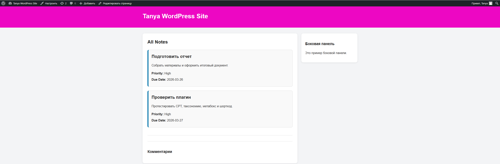

**Рисунок 13 - Результат работы шорткода [usm_notes before_date="2025-04-30"]**  
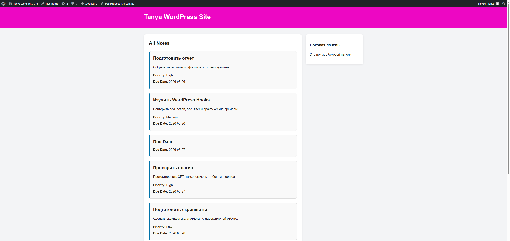

**Рисунок 14 - Сообщение «Нет заметок с заданными параметрами»**  
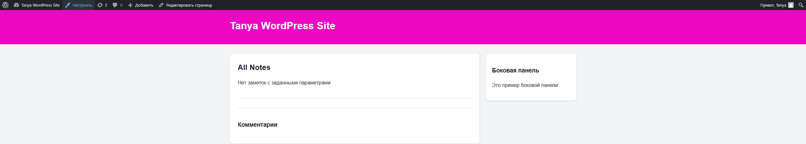

## Контрольные вопросы

### 1. Чем пользовательская таксономия принципиально отличается от метаполя? Приведи пример, когда выбрать таксономию, а когда — метаданные

Пользовательская таксономия нужна для **группировки и классификации записей**, а метаполе — для хранения **дополнительного значения конкретной записи**.

Таксономию удобно использовать, когда значения повторяются у многих записей. Например, в данной работе приоритеты **High**, **Medium** и **Low** лучше хранить как таксономию.

Метаданные подходят для индивидуальных параметров. Например, **Due Date** — это метаполе, потому что у каждой заметки своя дата.

### 2. Зачем нужен nonce при сохранении метаполей и что произойдёт, если его не проверять?

`Nonce` нужен для проверки, что запрос на сохранение был отправлен из WordPress, а не извне. Это защита от поддельных запросов.

Если не проверять `nonce`, злоумышленник может отправить вредоносный запрос от имени авторизованного пользователя и изменить данные записи. То есть система будет уязвима к CSRF-атакам.

### 3. Какие аргументы `register_post_type()` и `register_taxonomy()` чаще всего важны для фронтенда и UX?

Одним из самых важных аргументов является **`public`**, потому что он определяет, будет ли сущность доступна на сайте и видна пользователю.

Аргумент **`labels`** важен для удобства интерфейса в админке, так как отвечает за понятные названия кнопок и разделов.

Аргумент **`has_archive`** важен для фронтенда, потому что позволяет создать страницу архива для пользовательского типа записей.

Также важен **`show_in_rest`**, так как он нужен для корректной работы Gutenberg и REST API.

Для таксономий важны **`hierarchical`** и **`show_admin_column`**, потому что они делают интерфейс более удобным и наглядным.

## Список использованных источников

1. https://wordpress.org/
2. https://wordpress.org/plugins/
3. https://developer.wordpress.org/reference/functions/register_post_type/
4. https://developer.wordpress.org/reference/functions/register_taxonomy/
5. https://developer.wordpress.org/reference/functions/add_meta_box/
6. https://developer.wordpress.org/reference/functions/add_shortcode/
## Результат работы

В ходе выполнения лабораторной работы был успешно разработан пользовательский плагин WordPress **USM Notes**. Были изучены основные механизмы расширения системы: создание собственного типа записей, добавление пользовательской таксономии, работа с метаданными и метабоксами, а также вывод данных на сайте с помощью шорткода.

В результате был получен работоспособный плагин, который позволяет создавать заметки, задавать для них приоритет и дату напоминания, а затем выводить эти заметки на страницах сайта с использованием фильтрации.
