#  Лабораторная работа №5. Безопасность WordPress


## Цель работы

Закрепить ключевые практики безопасности WordPress: управление ролями и паролями, обновления, базовое hardening (wp-config.php, права, отключение редактора), резервное копирование, мониторинг активности и поэтапная настройка All In One WP Security & Firewall (AIOS) для защиты от брутфорса, базового WAF и контроля прав.


# Ход работы


## Шаг 1. Подготовка среды

Для выполнения лабораторной работы использовалась локальная установка WordPress, развернутая в среде XAMPP.

Была открыта административная панель сайта по адресу `/wp-admin`, и подтверждён доступ с правами администратора. Далее в конфигурационном файле `wp-config.php` был включён режим отладки путём установки параметра:

```php
define('WP_DEBUG', true);
```

Это позволяет отображать ошибки и упрощает процесс настройки и тестирования безопасности.

**Рисунок 1 – Административная панель WordPress**
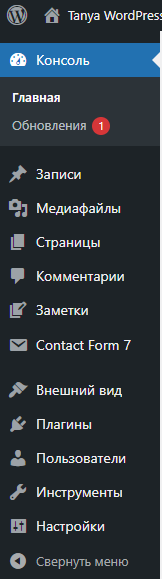

## Шаг 2. Управление ролями и паролями

На данном этапе был создан тестовый пользователь с ролью **Автор**, который используется для проверки разграничения прав доступа.

Также были проверены пароли пользователей с правами администратора. Все пароли соответствуют требованиям безопасности:

* не менее 8 символов
* содержат буквы, цифры и специальные символы

Это снижает риск подбора пароля злоумышленниками.

**Рисунок 2 – Создание тестового пользователя**
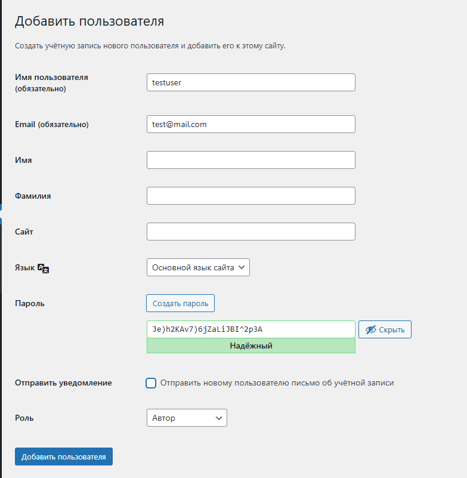

**Рисунок 3 – Список пользователей с ролью Author**
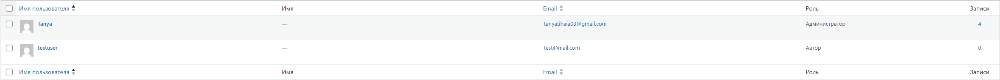


## Шаг 3. Обновления системы

Была выполнена проверка обновлений ядра WordPress, установленных тем и плагинов.

Все доступные обновления были установлены, после чего были включены автоматические обновления для тем и плагинов. После обновления была проверена работоспособность сайта — ошибок не обнаружено.

Это важно, так как устаревшие версии часто содержат уязвимости.

**Рисунок 4 – Раздел обновлений WordPress**
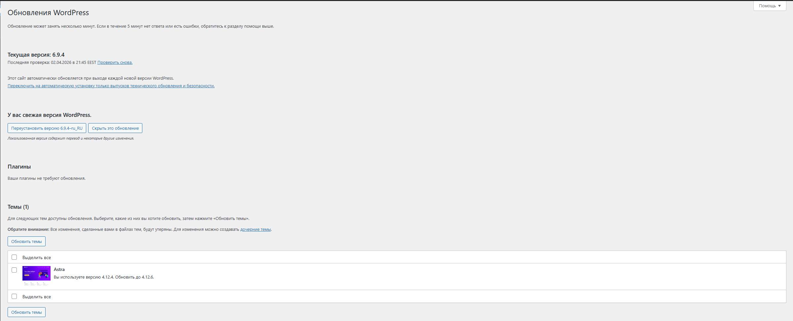

## Шаг 4. Базовое hardening

В конфигурационный файл `wp-config.php` была добавлена строка:

```php
define('DISALLOW_FILE_EDIT', true);
```

Это отключает возможность редактирования файлов через админ-панель.

Также были установлены стандартные права доступа:

* папки — 755
* файлы — 644

Дополнительно был защищён файл `wp-config.php` через `.htaccess`:

```apache
<files wp-config.php>
    order allow,deny
    deny from all
</files>
```

Это предотвращает несанкционированный доступ к конфигурации сайта.


**Рисунок 5 – Защита файла wp-config.php через .htaccess**
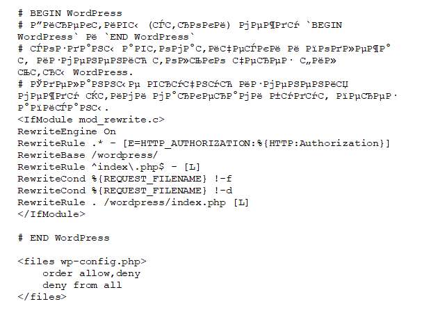


## Шаг 5. Установка и первичная настройка All In One WP Security & Firewall (AIOS)

На данном этапе был установлен и активирован плагин **All In One WP Security & Firewall (AIOS)**, предназначенный для комплексного повышения уровня безопасности WordPress-сайта. После активации плагина был открыт его раздел в административной панели, где была выполнена последовательная настройка ключевых параметров защиты.

Основная цель данного этапа — минимизировать риски несанкционированного доступа, защитить сайт от распространённых атак (таких как brute-force и XSS), а также обеспечить возможность мониторинга и восстановления данных.

**Рисунок 6 – Установленный плагин**

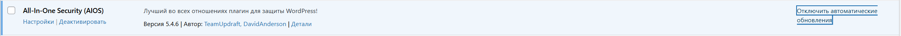

###  User Login

В разделе **User Login** была настроена защита формы авторизации. Для предотвращения атак методом перебора пароля была включена функция **Login Lockdown**, которая ограничивает количество неудачных попыток входа.

Были установлены следующие параметры:

- **Max Login Attempts** — **5**
- **Login Retry Time Period** — **15 минут**
- **Lockout Time** — **30 минут**

Такая конфигурация позволяет эффективно блокировать автоматические попытки входа, при этом не создавая значительных неудобств для реальных пользователей.

Дополнительно была включена функция **Force Logout** со значением **24 часа**, которая автоматически завершает сессии пользователей. Это особенно важно в случаях, когда пользователь забывает выйти из системы на общем или небезопасном устройстве.

**Рисунок 7 – Настройки Login Lockdown и Force Logout**  

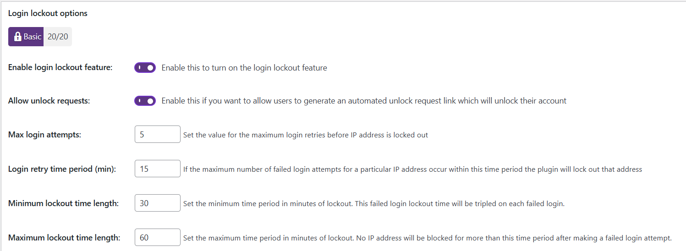


###  User Accounts

В разделе **User Accounts** была выполнена проверка существующих учётных записей. Особое внимание было уделено наличию стандартного логина `admin`, который является наиболее распространённой целью атак.

В результате проверки было установлено, что пользователь с логином `admin` отсутствует. Это повышает безопасность системы, поскольку злоумышленнику становится сложнее угадать корректную комбинацию логина и пароля.

**Рисунок 8 – Проверка пользователей и отсутствие логина admin**  

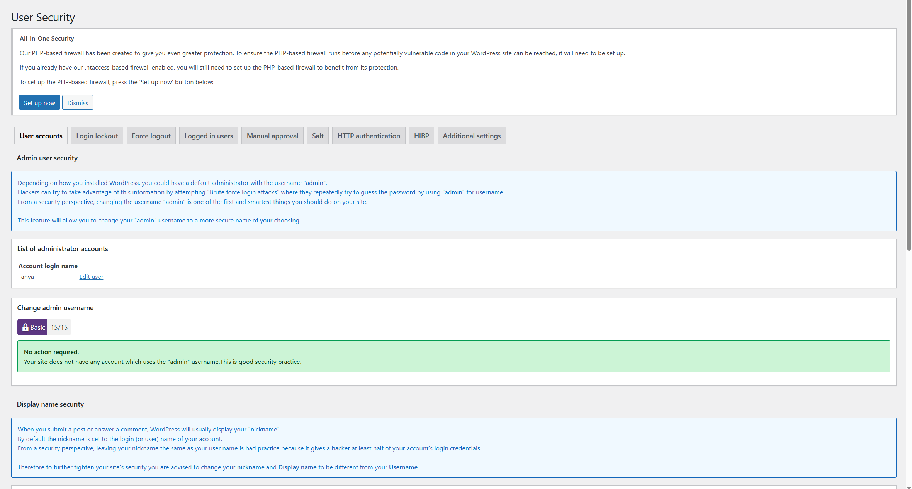


###  User Registration

Далее была проверена конфигурация регистрации новых пользователей. Было установлено, что параметр **Anyone can register** отключён, то есть регистрация новых пользователей через сайт невозможна.

Это решение позволяет предотвратить автоматическое создание аккаунтов ботами, снизить нагрузку на систему и исключить появление несанкционированных пользователей.

**Рисунок 9 – Отключённая регистрация пользователей**  

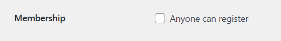


###  Filesystem Security

В разделе **Filesystem Security** была выполнена проверка безопасности файловой системы. Плагин определил, что сайт работает в локальной среде Windows (XAMPP), поэтому автоматическая проверка Unix-прав доступа ограничена.

Это является нормальным поведением, так как права доступа вида **755** и **644** применяются в основном в Linux-среде. Тем не менее, в отчёте были зафиксированы рекомендуемые значения:

- для папок — **755**
- для файлов — **644**

Эти параметры обеспечивают оптимальный баланс между доступностью и безопасностью файлов сайта.

**Рисунок 10 – Проверка File Security в локальной среде**  
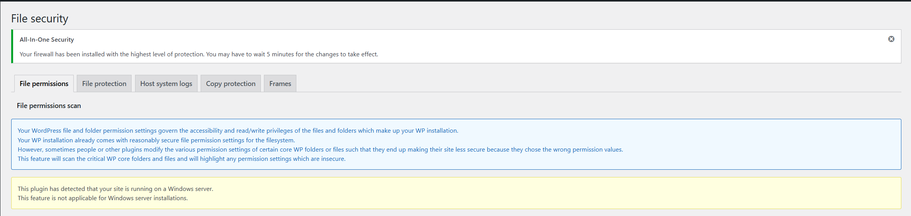


### Firewall

В разделе **Firewall** была выполнена настройка базовых механизмов защиты WordPress-сайта. Сначала был активирован **Basic Firewall**, который обеспечивает начальный уровень серверной фильтрации запросов и позволяет блокировать часть потенциально опасной активности ещё до обработки её системой WordPress. Данный механизм выступает первым уровнем защиты и помогает снизить риск эксплуатации типовых уязвимостей.

Дополнительно была включена функция **Bad Query Strings**, предназначенная для блокировки вредоносных URL-запросов и подозрительных параметров, которые могут использоваться при XSS-атаках и других попытках внедрения вредоносного кода. Это позволяет повысить устойчивость сайта к атакам, направленным через строку запроса.

Также была активирована функция **Disable directory listing**, запрещающая просмотр содержимого директорий сервера через браузер. Такая мера предотвращает раскрытие структуры каталогов и имён файлов сайта, что затрудняет сбор технической информации злоумышленниками.

В результате настройки раздела **Firewall** были включены основные защитные механизмы, направленные на фильтрацию подозрительных запросов, ограничение доступа к внутренней структуре сайта и повышение общего уровня безопасности WordPress.

**Рисунок 11 – Включение защиты от вредоносных запросов (Bad Query Strings)**  
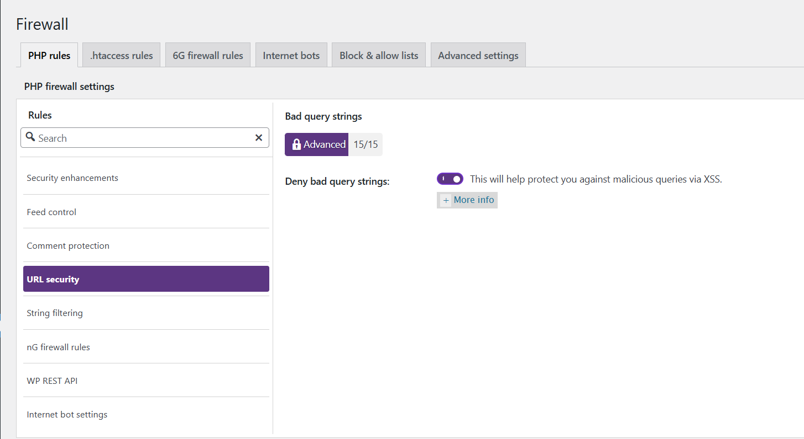

**Рисунок 12 – Активация базового уровня защиты firewall (Basic Firewall)**  
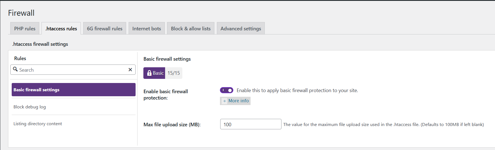

**Рисунок 13 – Отключение просмотра содержимого директорий (Disable directory listing)**  
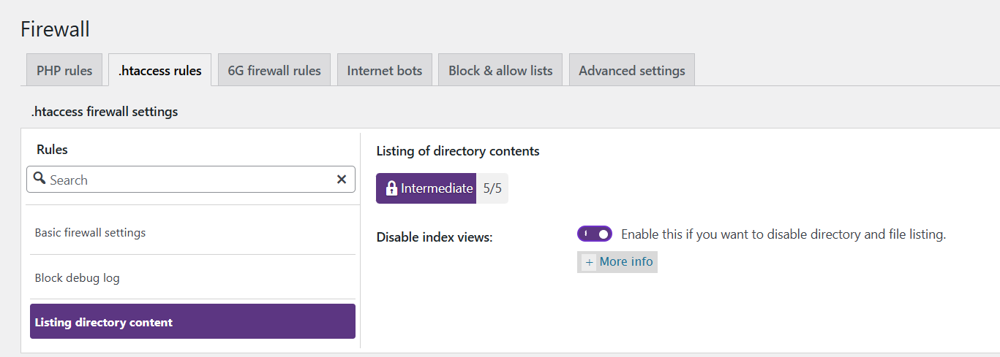

###  Brute Force

В разделе **Brute Force** была включена функция **Rename Login Page**, позволяющая изменить стандартный адрес входа `/wp-login.php` на нестандартный URL.

Такое изменение значительно снижает количество автоматических атак, так как большинство ботов ориентируются на стандартные пути WordPress. В результате уменьшается нагрузка на сервер и повышается общий уровень безопасности.

**Рисунок 14 – Изменение URL страницы входа**  
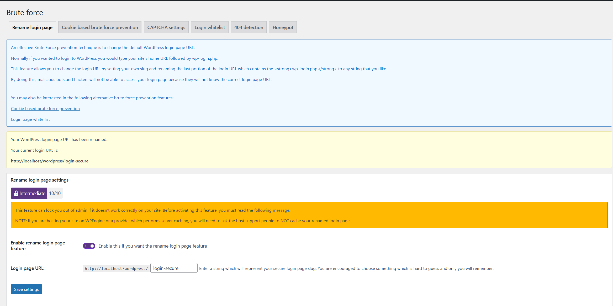


###  Scanner / Malware

В разделе **Scanner / Malware** была настроена функция **File Change Detection**, позволяющая отслеживать изменения файлов сайта. Это важно для выявления несанкционированных изменений, которые могут свидетельствовать о взломе или внедрении вредоносного кода.

Также были включены уведомления, позволяющие оперативно получать информацию о любых изменениях файлов системы.

**Рисунок 15 – Настройка контроля изменений файлов**  
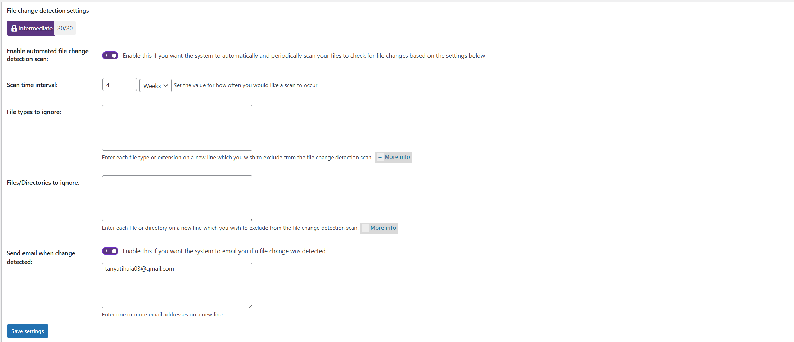


###  Backup

В разделе **Database Security** была создана резервная копия базы данных WordPress. Резервное копирование является критически важным элементом безопасности, так как позволяет восстановить сайт в случае сбоя, ошибки конфигурации или потери данных.

Созданная копия может быть использована для полного восстановления состояния сайта.

**Рисунок 16 – Создание резервной копии базы данных**  
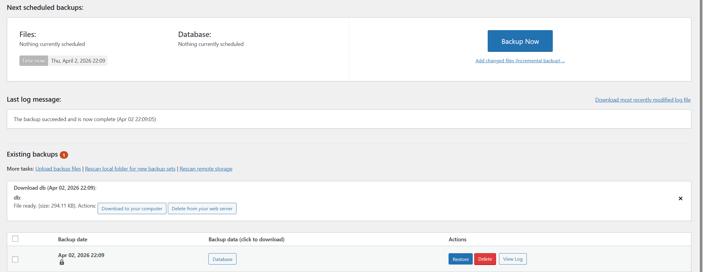

###  Notifications

Дополнительно были настроены email-уведомления о событиях безопасности. В частности, были включены уведомления о блокировках при превышении количества неудачных попыток входа.

Это позволяет своевременно реагировать на подозрительную активность и контролировать состояние безопасности сайта.

**Рисунок 17 – Настройка уведомлений безоп  асности**  
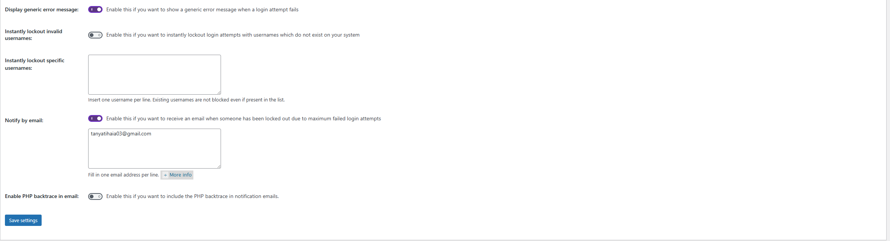

## Шаг 6. Проверка защиты от брутфорса

Была проведена проверка защиты от брутфорс-атак.

Для этого выполнено несколько неудачных попыток входа (5–6 раз). После этого система автоматически заблокировала доступ.

Информация о блокировке была зафиксирована в журнале событий плагина.

**Рисунок 18 – Сообщение о блокировке входа**
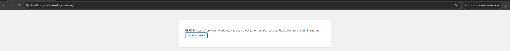

**Рисунок 19 – Логи блокировки в системе**
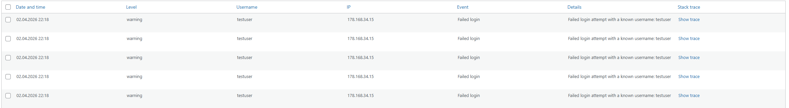


## Шаг 7. Восстановление из резервной копии

Для проверки восстановления данных были удалены:

* тестовый пользователь
* тестовая запись
* изображение

После этого было выполнено восстановление базы данных из резервной копии через импорт SQL-файла.

В результате:

* пользователь был восстановлен
* запись появилась снова
* изображение вернулось

Это подтверждает корректную работу резервного копирования.

**Рисунок 20 – Удаление тестового пользователя**
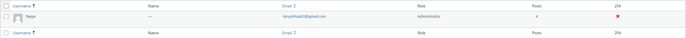

**Рисунок 21 – Удаление тестовой записи**
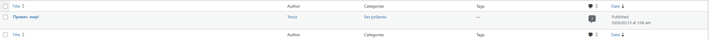

**Рисунок 22 – Удаление изображения**
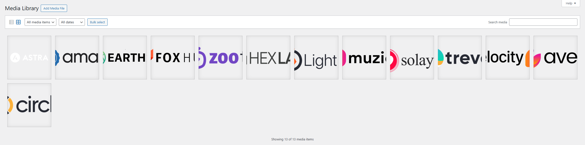

**Рисунок 23 – Восстановленные записи**
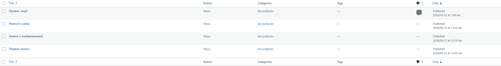

**Рисунок 24 – Восстановленное изображение**
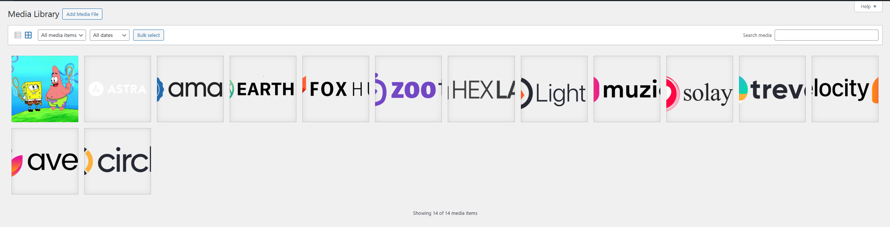

**Рисунок 25 – Восстановленный пользователь**
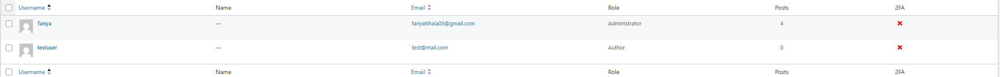

## Контрольные вопросы

### 1. Почему `DISALLOW_FILE_EDIT` и правильные права на `wp-config.php` существенно уменьшают риск пост-эксплойта?

Параметр `DISALLOW_FILE_EDIT` отключает редактирование файлов темы и плагинов через админ-панель WordPress. Это важно, потому что даже если злоумышленник получит доступ к аккаунту администратора, он не сможет быстро встроить вредоносный код через встроенный редактор.

Файл `wp-config.php` содержит данные подключения к базе, ключи безопасности и важные параметры сайта. Если доступ к нему защищён правильно, злоумышленнику будет намного сложнее изменить конфигурацию сайта или получить критически важные данные.

Следовательно, эти меры уменьшают риск закрепления злоумышленника в системе после взлома.


### 2. Какие параметры Login Lockdown / Firewall были выбраны и почему именно такие?

Для **Login Lockdown** были выбраны такие параметры:

- **Max Login Attempts** — **5**
- **Login Retry Time Period** — **15 минут**
- **Lockout Time** — **30 минут**

Такие значения хорошо подходят для баланса между безопасностью и удобством. Они ограничивают автоматический перебор пароля, но при этом не создают слишком больших неудобств обычному пользователю.

Для **Firewall** были включены:

- **Basic Firewall**
- **Bad Query Strings**
- **Disable Directory Listing**

Эти настройки обеспечивают базовую защиту сайта от вредоносных запросов, XSS-атак и раскрытия структуры директорий, не нарушая нормальную работу WordPress.


### 3. Чем отличаются меры защиты на уровне WordPress (плагин / WAF) от мер на уровне веб-сервера и ОС?

Защита на уровне **WordPress** работает внутри самой CMS. Это, например, ограничение попыток входа, контроль изменений файлов, смена URL входа и резервное копирование.

Защита на уровне **веб-сервера** работает раньше, чем запрос попадёт в WordPress. Сюда относятся правила `.htaccess`, блокировка IP, запрет просмотра директорий и фильтрация опасных запросов.

Защита на уровне **операционной системы** отвечает уже за безопасность всей среды: права доступа к файлам, системные пользователи, брандмауэр, обновления и общая защита сервера.


### 4. Что обязательно включать в «полный» бэкап WordPress и как проверяется корректность восстановления?

Полный backup WordPress должен включать:

- **базу данных**;
- **файлы сайта**;
- **папку `wp-content`** с темами, плагинами и медиафайлами;
- при необходимости — **`wp-config.php`**.

Проверка восстановления должна выполняться на практике. В данной работе для этого были удалены пользователь, запись и изображение, после чего выполнено восстановление из резервной копии. Так удалось убедиться, что backup действительно рабочий и позволяет вернуть данные.


# Результат работы

В ходе лабораторной работы были изучены и применены основные методы защиты WordPress-сайта. Настроены механизмы защиты от брутфорс-атак, реализован базовый firewall, выполнено резервное копирование и проверено восстановление данных.

В результате сайт стал защищён от основных угроз, а также получены практические навыки настройки безопасности WordPress.

